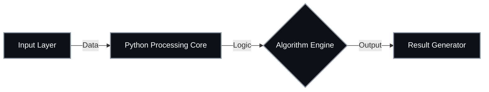

<div align="center">


<p align="center">
  
  
  
  
</p>

  


</div>

---

## Overview

> Real-time visual effect cloaking system using color segmentation.

**Harry Potter Invisibility Cloak** is a proprietary general system engineered by **Karthik Idikuda**. It leverages OpenCV for its core functionality.

<br/>

## System Architecture



<br/>

## Project Structure

```
Harry-Potter-Invisibility-Cloak/
  LICENSE
  README.md
  blue_cloak_simple.py
  color_calibrator.py
  full_invisibility_cloak.py
  invisibility_cloak_gui.py
  requirements.txt
  setup.sh
  simple_cloak.py
```

<br/>

## Technical Specifications

| Attribute | Detail |
|:---|:---|
| **Primary Language** | `Python` |
| **Project Category** | `General` |
| **Total Source Files** | `9` |
| **Frameworks** | `OpenCV` |
| **Key Dependencies** | `opencv-python` | `Pillow` | `numpy` |
| **Intellectual Property** | `Strictly Proprietary` |

<br/>

## STRICT LEGAL WARNING & LICENSE

> **PROPRIETARY AND CONFIDENTIAL**

This software and all associated documentation are the **exclusive property of Karthik Idikuda**.

- **NO PERMISSION IS GRANTED** to use, copy, modify, merge, publish, distribute, sublicense, or sell copies of this software without explicit, written consent from the author.
- **UNAUTHORIZED USE WILL RESULT IN SEVERE LEGAL ACTION.** Any individual or organization found using, referencing, or deploying this code without paying the required licensing fees will face immediate litigation, financial penalties, and potentially criminal prosecution where applicable by law.
- **TO OBTAIN A LEGAL LICENSE**, you must directly contact Karthik Idikuda to negotiate payment terms.

*By accessing this repository, you acknowledge and accept these strict proprietary terms.*

---

<div align="center">
  
</div>

<!-- TRACKING: S0ktSGFycnktUG90dGVyLUludmlzaWJpbGl0eS1DbG9hay1UUkFDSw== -->
